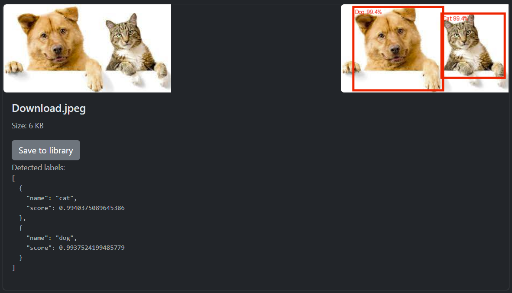
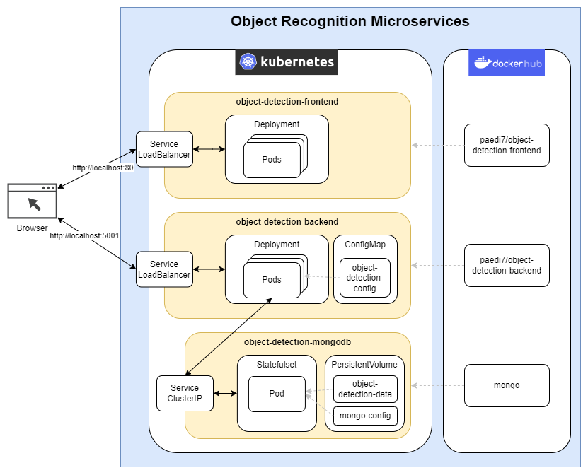

# Object Recognition Microservices

This app was built for the "Assignment: Build Something" in the "(PA2577) Applied Cloud Computing and Big Data" course.

## Description

The main aim of this app is to recognise objects in images.
You can upload any jpeg or png file to the application.
Press "Detect objects" and wait for about 10 seconds.
The application then displays the uploaded image with boxes around the recognised objects.
The boxes contain the name of the object and the percentage of how accurately the object was recognised.
If you want to keep your work, you can save the image to your library.

## Software Architecture

### Object Detection Frontend:
Technologies: Angular, Node, Nginx

Provides a user interface for interacting with the object detection system.
Handles user requests, sends image data to the backend, and displays results.

### Object Detection Backend:
Technologies: Python, Flask

Processes image data, performs object detection, and communicates with the database.
Receives image data from the frontend, processes it using the deployed model, and stores results in the database.

### Object Detection MongoDB:
Technologies: MongoDB

Stores object detection results and related data.
Provides a persistent storage solution for the backend to store and retrieve object detection results.

### Architecture Principles:
- Microservices: Splits the system into smaller, independently deployable services to ensure scalability, maintainability and flexibility.
- Load balancing: Distributes incoming requests to multiple replicas of the front-end and back-end services to improve performance and availability.
- ConfigMap: Separates configuration details (e.g. database connection parameters) from application code, allowing for easier configuration changes.
- StatefulSet: Ensures stable storage of the MongoDB service by maintaining a consistent network identity for each pod, which is critical for databases that require persistent data.

### Benefits
- Scalability: The microservices architecture enables independent scaling of front-end and back-end components as required.
- Flexibility: Microservices enable the use of different technologies for different components and therefore flexibility in development and deployment.
- Reliability: Load balancing and replication of services increase the reliability and fault tolerance of the system.

### Challenges:
- Complexity: 
    - The division into microservices makes it more difficult to maintain an overview.
    - Remedy: Use of a software architecture diagram
- Communication overhead:
    - Communication between services can lead to latency and complexity.
    - Remedy: Use asynchronous communication where appropriate.
- Data consistency: 
    - Ensuring consistency of data across microservices.
    - Mitigation: Consistent naming and design for idempotence -> follow REST guidelines.

### Security Considerations:
Due to the scope of this project, not many security aspects have been considered. To make this application secure, the following measures should be considered:

- Network security: Use HTTPS for secure communication.
- Data security: The database should be protected with a user name and password.
- Container security: Image scanning in Docker Hub should be enabled. 
- Monitoring and logging: Comprehensive monitoring and logging should be added to detect and respond to security incidents in a timely manner.
- Authentication and authorisation: Secure login and session management should be added.

## Links
[Github - object-recognition-microservices](https://github.com/PDI7/object-recognition-microservices)